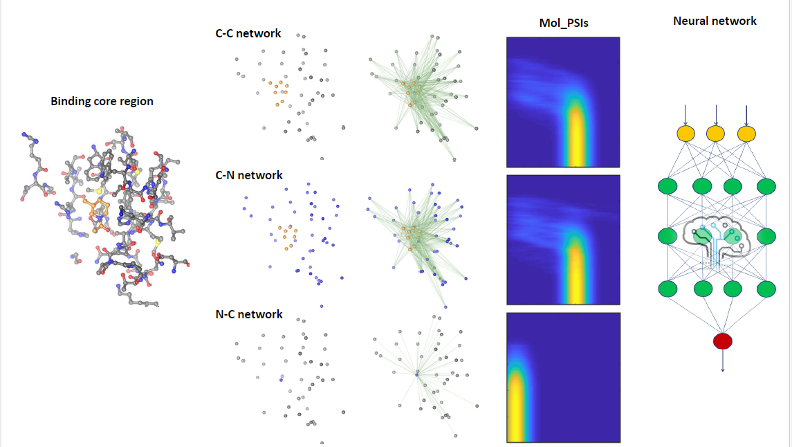
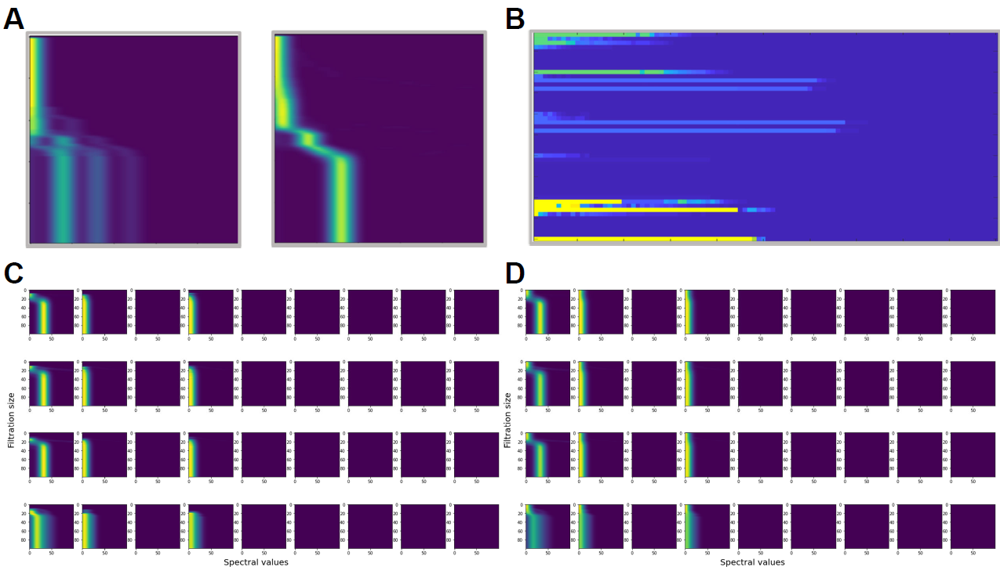
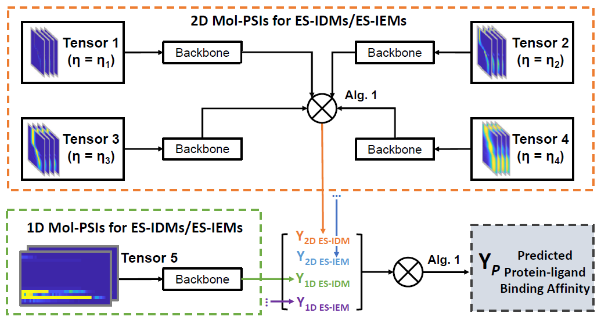

# Molecular persistent spectral image (Mol-PSI) representation for machine learning models in drug design

## Abstract
Artificial intelligence (AI) based drug design has great promise to fundamentally change the landscape of pharmaceutical industry. Even though there are great progresses from feature engineering based deep learning, 3D convolutional neural networks (representation learning ) and graph neural networks (GNN), effective and efficient representations that characterize the structural, physical, chemical and biological properties of molecular structures and interactions remain to be a great challenge. Here we propose **Mol**ecular **P**ersistent **S**pectral **I**mage (**Mol-PSI**) representation and combine it with representation learning  model for AI based drug design. In general, deep models are empowered to achieve better performance with systematically organised representations in image format. We use **Per**sistent **Spect**ral (**PerSpect**) models, in particular PerSpect simplicial complex, to characterize molecular structures and interactions, and further embed the molecular information into a series of persistent spectral images. Our Mol-PSIs provide a multi-scale molecular representation that naturally incorporates structural and physical information of molecular data. A well-designed parallel representation learning  architecture for adapting Mol-PSIs is then used to process all above unique features. Our results, for the three most commonly-used databases including PDBbind-v2007, PDBbind-v2013 and PDBbind-v2016, are better than all traditional machine learning models, as far as we know. Our Mol-PSI model provides a powerful molecular representation that can be widely-used in AI-based drug design and molecular data analysis.

## The general pipeline of framework of our work

  

## The example Mol-PSIs from both 1D and 2D 

  

## The computational framework (Cascade multiple NNs) of PerSpect Models

  

## Requirements and Installation

PerSpect is implemented by Python3. If you don't have python, please download [Anaconda](https://www.anaconda.com/download/#linux) with python 3 version.

The detailed environments and requirements are listed in directory Doc.

## Command lines

As the 3-year dataset is very large, and the command lines they are using are very similar except for the year parameter "--year 2007/2013/2016", below we only introduce the command lines for year 2007 as an example.
 
1. Tensor preparation:

From http://www.pdbbind.org.cn/ download year 2007 data into folder "PDB_data". Decompress two data files "2007_normDist_eigv.tar.gz" and "2007_elecDist_eigv.tar.gz" to two new folders "2007_normDist" and "2007_elecDist" respectively.
 
tar -zxvf 2007_normDist_eigv.tar.gz -C ./2007_normDist

tar -zxvf 2007_elecDist_eigv.tar.gz -C ./2007_elecDist

In folder "1_Tensor_preparation", run the following command:

python3 generate_tensors.py

Please pay attention, we use 4 sigma values (0.0001, 0.75, 1.5, 2.25) to form each year tensors. Process each-sigma tensor generation in parallel can save lots of time, same to the 2 different datatypes normDist and elecDist. 

All result tensors will be saved into a folder named "Temp_tensor_Dec_12" (you can change the date to your current date) in PDB_data folder. After all threads or processes finish, please rename the folder to "input_tensors" (to avoid being removed or changed by mistakes in rerun the same command). 

2. Model initialization: 

(As we have attached the result file of this stage "y_2016_split_by_pred_test_bins30_checked.npy" in the folder "Initialization_bins", running this stage command is optional. You can jump to "3. Batch training and test". Only if you want to know how this file is created, or want to adjust related training parameters, please go through the following 2rd-stage details.)

Enter the folder "2_Model_initialization", use the following command to generate initialization bin file "y_2016_split_by_pred_test_bins30_checked.npy" (Please pay attention, here we use year 2016 sigma 1.5 and year 2013 es0 training data to initialize the model. Thus, please also download year 2016 and 2013 data, and prepare the tensors for year 2016 normDist sigma 1.5 and elecDist sigma 1.5 models, and year 2013 es0 model, following the guidance illustrated in stage 1 "Tensor preparation". You can also contact us to supply above interim results.):

python3 create_init_bins.py --valid_bins_num 30

File "y_2016_split_by_pred_test_bins30_checked.npy" will appear inside the folder "cls_models" under "log_[date]". Copy this file to "Initialization_bins" folder for use in next stage (current bin file in use is already in this folder).

3. Batch training and test:

This stage is the batch training, test and best model generation. Run the following commands in parallel (best on different GPU cards):

python3 batch_test.py --year 2007 --sigma 0.0001 --model Resnet --datatype es --batch_size 512 --num_repeat 20

python3 batch_test.py --year 2007 --sigma 0.75 --model Resnet --datatype es --batch_size 512 --num_repeat 20

python3 batch_test.py --year 2007 --sigma 1.5 --model Resnet --datatype es --batch_size 512 --num_repeat 20

python3 batch_test.py --year 2007 --sigma 2.25 --model Resnet --datatype es --batch_size 512 --num_repeat 20

python3 batch_test.py --year 2007 --sigma 0.0001 --model Resnet --datatype elec --batch_size 512 --num_repeat 20

python3 batch_test.py --year 2007 --sigma 0.75 --model Resnet --datatype elec --batch_size 512 --num_repeat 20

python3 batch_test.py --year 2007 --sigma 1.5 --model Resnet --datatype elec --batch_size 512 --num_repeat 20

python3 batch_test.py --year 2007 --sigma 2.25 --model Resnet --datatype elec --batch_size 512 --num_repeat 20

python3 batch_test.py --year 2007 --sigma None --model Resnet --datatype es0 --batch_size 512 --num_repeat 20

python3 batch_test.py --year 2007 --sigma None --model Resnet --datatype elec0 --batch_size 512 --num_repeat 20

All results will be written into a folder named log[current date], and you can find the best model Pearson correlation and its corresponding epoch number in model names. All test will run 20 times according to above setting, which you can change by assign another number to "num_repeat".

4. Model fusion:

This is to fuse various models using different parameters like sigma, 1D or 2D data input. For instance, for method "Resnet", all above 10 commands (in "Batch test" stage) result best models will be fused together. 

Please first pick and copy the best models into folder ./best_model5/, and rename the model file into this format: try_{i} _ {method} _ {datatype} _ {sigma} _ {year}.pth . "i" is the test round number, "method" use Resnet first. 

Then use the command: 

python3 model_merge.py 

(if the test round is default value "1"). 

For other test round, e.g. round 20, use this command:

python3 model_merge.py --num_repeat 20

Than, you will see the final Pearson correlation and RMSE. 

## Usage details: the function of each executive file or resource is listed below

### Directory

- **Doc**

This directory includes demo files and demo figures. The environments and requirements are also listed here.

- **PDB_data**

The corresponding raw data for Perspect. Tensors by years, type of ES-IDM/ES-IEMs, sigmas, PDB IDs are well organized. 

- **Initialization_bins**

Previous well trained bin classification used as cache.

- **Backup_model**

The base models for transfer learning, we refine base models for each method and each type of tensors. We also cached the bin prediction models for fine tune.

- **log_{MonthDay}**

Mutiple tries with its start date. Models (including validation models, best models as well as bin classification models) could be found in this subdirectory and the corresponding training and validation logs could be also found here.

### File 

- **batch_test.py**

To train and test all experiments, follow the next command lines and run by shell.
 WARRNING ! This may take many hours or days depending on your computational performance. It doesn't support distributed training currently. The possible experiments are listed:

year = [PDBbind v2007, PDBbind v2013, PDBbind v2016] 
types = [ES-IDM 1D (es0), ES-IEM 1D (elec0), ES-IDM 2D (es) and ES-IEM 2D (elec)]
sigmas = [0.0001, 0.75, 1.5, 2.25]
models = [Densenet for 2D/1D Mol-PSIs, Resnet for 2D/1D Mol-PSIs, (Image) Transformer for 1D Mol-PSIs']

The process of batch_test.py is similar to sequential grid search of hyper parameters .

- **dataset.py**

To load Perspect data from original raw data and precess it into model-friendly format.

- **models.py**

To organize single models include Resnet based backbone, Densenet based backbone, 2D-Transformer based backbone and other sophisticated models.

###### transfer initial weights from:
  > + **Resnet (es)** 2007_es_0.0001_res params.pt epoch = 148
  > + **Resnet (elec)** 2007_elec_0.0001_res params.pt epoch = 73
  > + **Resnet (es0)** 2007_es0_res params.pt epoch = 59
  > + **Resnet (elec0)** 2007_elec0_res params.pt epoch = 64

  > + **Densenet (es)** 2007_es_0.0001_dense params.pt epoch = 62
  > + **Densenet (elec)** 2007_elec_0.0001_dense params.pt epoch = 193
  > + **Densenet (es0)** 2007_es0_dense params.pt epoch = 46
  > + **Densenet (elec0)** 2007_elec0_dense sparams.pt epoch = 38

  > + **Transformer (es)** 2007_es_0.0001_trans params.pt epoch = 45
  > + **Transformer (elec)** 2007_elec_0.0001_trans params.pt epoch = 13

- **model_merge.py**

To fuse various models using different parameters like sigma, 1D or 2D data input. 

- **args.py**
Process and parse command arguments for the next pipline 
> usage: python main.py [args]
>
> major arguments 
  [-h] 
  [--year YEAR]
  [--model MODEL] 
  [--sigma SIGMA]
  [--datatype DATATYPE] 
  [--num_epoch NUM_EPOCH]
  [--transfer_model TRANSFER_MODEL] 
  [--gpu]
  [--cuda]
  [--seed SEED] 
  [--lr LR]
  [--weight_decay WEIGHT_DECAY]
  [--num_repeat NUM_REPEAT]
  
#####  all arguments:
  > + -h, --help  show this help message and exit
###### dataset
  > + --year, type=str, default=2007, help=PDBbinding dataset v(2007, 2013, 2016)
  > + --model, type=str, default=Resnet, help=Deep backbones to extract features from Mol-PSIs.\
  > + --Densenet, Resnet for 2D/1D Mol-PSIs, (Image) Transformer for 1D Mol-PSIs
  > + --sigma, type=float, default=None, help=Dimensionality of scale parameter sigma (0.0001, 0.75, 1.5, 2.25)
  > + --datatype, type=str, default=es0, help=ES-IDM 1D (es0), ES-IEM 1D (elec0), ES-IDM 2D (es) and ES-IEM 2D (elec)

###### train
  > + --num_epoch, type=int, default=1001, help=number of training epoch
  > + --batch_size, type=int, default=1024, help=number of data points for each itration
  > + --gpu, action=store_true, default=True, help=Disables CUDA training.
  > + --cuda, dest=cuda, default=0, type=str
  > + --seed, type=int, default=11, help=Random seed for all random situation.
  > + --lr, type=float, default=4e-5, help=Initial learning rate.
  > + --transfer_model, type=bool, default=False, help=Training from the transfer model
  > + --weight_decay, type=float, default=1e-7, help=Weight decay (L2 loss on parameters).
  > + --num_repeat, type=int, default=5, help=Number of tries for the same experiments

###### valid
  > + --valid_model, type=bool, default=True, help=Training from the transfer model
  > + --valid_method, type=str, default=bins_pred, help=Stratified the train and valid subsets by random/bins/bins_pred/exist_model
  > + --valid_bins_num,dest=num_bins, type=int, default=30, help=The number of bins used for (--valid_method bins/bins_pred 30,50,75,90,125,150)
  > + --valid_path, type=str, default=, help=load valid model state dict when transfering on exist model (--valid_method exist_model)
  > + --valid_size, type=int, default=0.2, help=Number of training dataset used for transfer
  > + --valid_seed, type=int, default=11, help=Random seed for validation dataset selection
  > + --valid_num_epoch, type=int, default=51, help=number of transfer epoch
  > + --valid_batch_size, type=int, default=256, help=number of data points for each transfering itration
  > + --valid_lr, type=float, default=5e-3, help=Initial transfer learning rate.
mensionality of scale parameter sigma (0.0001, 0.75, 1.5, 2.25)
  > + --datatype DATATYPE   ES-IDM 1D (es0), ES-IEM 1D (elec0), ES-IDM 2D (es) and ES-IEM 2D (elec)
  > + --num_epoch NUM_EPOCH number of training epoch
  > + --transfer_model TRANSFER_MODEL Training from the transfer model (load weights and state_dict)
  > + --cuda                Disables CUDA training.
  > + --seed SEED           Random seed.
  > + --lr LR               Initial learning rate.
  > + --weight_decay WEIGHT_DECAY Weight decay (L2 loss on parameters).
  > + --num_repeat NUM_REPEAT Number of tries for the same experiments
 
  The transfer_model option is to load pre-trained models with respect to the same model architecture, the details for each transfer models is as follows:

- **perspect.py**

The major reservoir of Perspect, including backbone usage, training tools, train hooks, customized loss and main computational flow. 

- **utils.py**

Other miscellaneous utils for convenience.

## Citation

If you find our work helpful in your research or work, please cite us.

Molecular persistent spectral image (Mol-PSI) representation for machine learning models in drug design, under review at *Briefings in Bioinformatics*, 2021.  

## Questions & Problems

If you have any questions or problems, please feel free to open a new issue. We will fix the new issue ASAP. You can also email the maintainers and authors below.

**Peiran Jiang, Ying Chi** (peiran@cmu.edu, xinyi.cy@alibaba-inc.com) 
